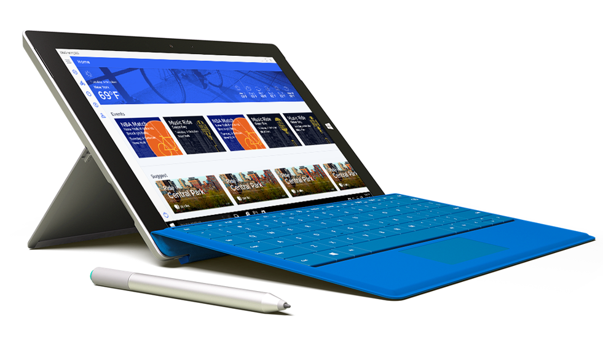
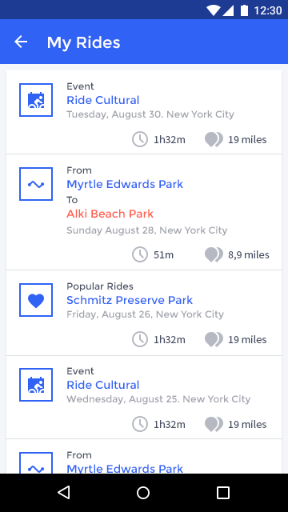
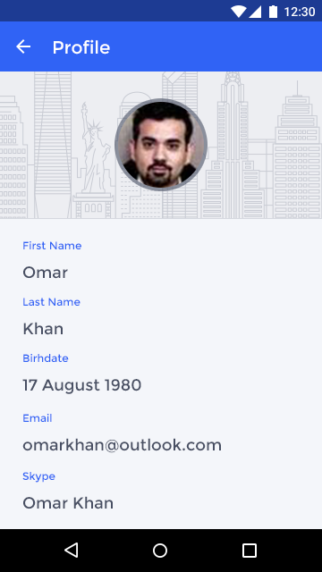
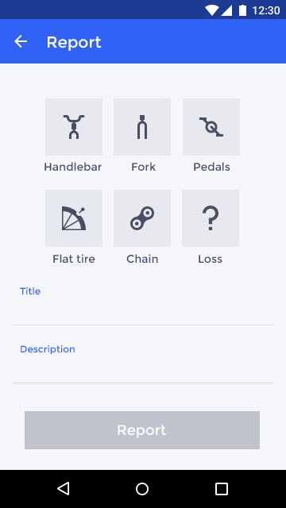
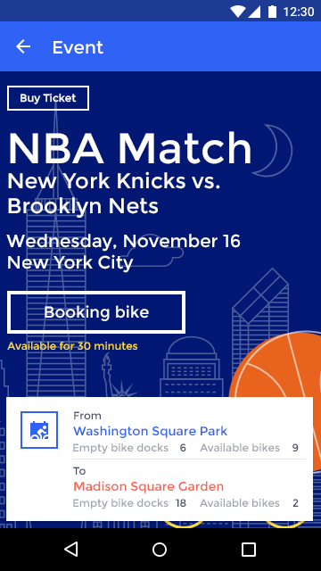
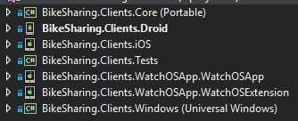
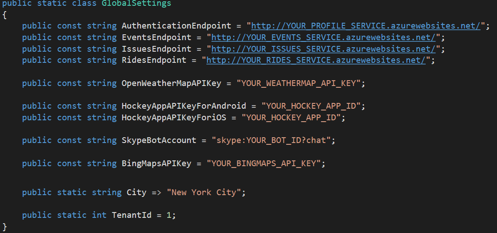

#BikeSharing360

During our Connect(); event this year we presented 15 demos in Scott Guthrie’s and Scott Hanselman’s keynotes. If you missed the keynotes, you can watch the recording in [Channel 9](https://channel9.msdn.com/Events/Connect/2016/Keynotes-Scott-Guthrie-and-Scott-Hanselman).

This year, we built the technology stack for a fictional company named BikeSharing360, which allows users to rent bikes from one location to another.

BikeSharing360 is a fictitious example of a smart bike sharing system with 10,000 bikes distributed in 650 stations located throughout New York City and Seattle. Their vision is to provide a modern and personalized experience to riders and to run their business with intelligence.

In this demo scenario, we built several apps for both the enterprise and the consumer (bike riders). You can find all other BikeSharing360 repos in the following locations:

*[Mobile Apps](https://github.com/Microsoft/BikeSharing360_MobileApps)
*[Backend Services](https://github.com/Microsoft/BikeSharing360_BackendServices)
*[Websites](https://github.com/Microsoft/BikeSharing360_Websites)
*[Single Container Apps](https://github.com/Microsoft/BikeSharing360_SingleContainer)
*[Multi Container Apps](https://github.com/Microsoft/BikeSharing360_MultiContainer)
*[Cognitive Services Kiosk App](https://github.com/Microsoft/BikeSharing360_CognitiveServicesKioskApp)
*[Azure Bot App](https://github.com/Microsoft/BikeSharing360_BotApps)

#BikeRider Xamarin app and Maintenance Cordova app
This repository contains the BikeRider consumer-facing mobile apps for renting bikes and the BikeSharing360 maintenance app built with Cordova.

**Note:** This document is about the **Xamarin apps**. For the [Cordova app click here](./Cordova.md).

### Supported Platforms: iOS, Android, and Windows
The BikeRider app is available for three platforms:

* iOS (including a watchOS app)
* Android
* Universal Windows Platform (UWP)

BikeRider features **93.7% code share** across all platforms (7.34% iOS / 8.61% Android / 2.72% Windows).

## Xamarin.Forms App (BikeRider)

[Xamarin.Forms](https://www.xamarin.com/forms) allows you to build native UIs for iOS, Android, and Windows from a single, shared codebase. You can dive into mobile development with Xamarin.Forms by following our [free self-guided learning](https://university.xamarin.com/classes/track/self-guided) from Xamarin University. This project exercises the following patterns and features:

* Xamarin.Forms
  * [XAML UI](https://developer.xamarin.com/guides/xamarin-forms/xaml/xaml-basics/)
  * [Animations](https://developer.xamarin.com/guides/xamarin-forms/user-interface/animation/)
  * Converters
  * Custom Controls
  * [Custom Renderers](https://developer.xamarin.com/guides/xamarin-forms/custom-renderer/)
  * [Data Binding](https://developer.xamarin.com/guides/xamarin-forms/xaml/xaml-basics/data_binding_basics/)
  * [Effects](https://developer.xamarin.com/guides/xamarin-forms/effects/)
  * IoC
  * [Messaging Center](https://developer.xamarin.com/guides/xamarin-forms/messaging-center/)
  * [MVVM](https://developer.xamarin.com/guides/xamarin-forms/xaml/xaml-basics/data_bindings_to_mvvm/)
  * [Native View Declaration](https://developer.xamarin.com/guides/xamarin-forms/user-interface/native-views/)
  * [Plugins for Xamarin](https://www.xamarin.com/plugins)
  * [Styles](https://developer.xamarin.com/guides/xamarin-forms/user-interface/styles/)
  

## Screens

## Licenses

This project uses some third-party assets with a license that requires attribution:

- Roboto Font: by Christian Robertson (Roboto at Google Fonts)
- [Xamarin.Plugins](https://github.com/jamesmontemagno/Xamarin.Plugins): by James Montemagno
- [FFImageLoading](https://github.com/daniel-luberda/FFImageLoading): by Daniel Luberda
- [ACR User Dialogs](https://github.com/aritchie/userdialogs): by Allan Ritchie
- [CircularProgress Control](https://github.com/billreiss/xamlnative/tree/master/XamarinForms/CircularProgress): by Bill Reiss
- [Xamarin.Forms Animation Helpers](https://github.com/jsuarezruiz/Xamanimation): by Javier Suárez

## Requirements
* Windows 10
* [Visual Studio __2015__](https://www.visualstudio.com/en-us/products/vs-2015-product-editions.aspx) Update 3 (14.0 or higher) to compile C# 6 language features (or Visual Studio MacOS)
* Xamarin add-ons for Visual Studio 3.2.1.64 or higher (available via the Visual Studio installer)
* __Visual Studio Community Edition is fully supported!__
* Android SDK Tools 25.2.3 or higher
* OpenWeatherMap Key - [Getting a OpenWeatherMap Api Key](https://openweathermap.org/appid)
* Bing Maps Key - [Getting a Bing Maps Key](https://msdn.microsoft.com/en-us/library/ff428642.aspx)
* Microsoft Azure subscription

## Setup

**Download** or clone the repository. This is a solution with seven projects.

**Rebuild** the solution to get all neccesary **NuGet** packages.

Access to **GlobalSettings.cs** file available in the Portable Class Library to introduce your Azure endpoints and APIs keys.

**Deploy to Azure**

Use the [Backend Services repository](https://github.com/Microsoft/BikeSharing360_BackendServices) to deploy backend services for Xamarin App to your subscription.

Enjoy!

## How to sign up for Microsoft Azure

You need an Azure account to work with this demo code. You can:

- Open an Azure account for free [Azure subscription](https://azure.com). You get credits that can be used to try out paid Azure services. Even after the credits are used up, you can keep the account and use free Azure services and features, such as the Web Apps feature in Azure App Service.
- [Activate Visual Studio subscriber benefits](https://www.visualstudio.com/products/visual-studio-dev-essentials-vs). Your Visual Studio subscription gives you credits every month that you can use for paid Azure services.
- Not a Visual Studio subscriber? Get a $25 monthly Azure credit by joining [Visual Studio Dev Essentials](https://www.visualstudio.com/products/visual-studio-dev-essentials-vs).

## Blogs posts and videos

Here's links to blog posts related to this project:

- The Visual Studio Blog: [Connect(“demos”); // 2016: BikeSharing360 on GitHub](https://blogs.msdn.microsoft.com/visualstudio/2016/12/14/connectdemos-2016-bikesharing360-on-github/)
- The Visual Studio Blog: [Announcing the new Visual Studio for Mac](https://blogs.msdn.microsoft.com/visualstudio/2016/11/16/visual-studio-for-mac/)
- The Visual Studio Blog: [Introducing Visual Studio Mobile Center (Preview)](https://blogs.msdn.microsoft.com/visualstudio/2016/11/16/visual-studio-mobile-center/)
- The Visual Studio Blog: [Visual Studio 2017 Release Candidate](https://blogs.msdn.microsoft.com/visualstudio/2016/11/16/visual-studio-2017-rc/)
- Visual Studio Toolbox: [Exploring our newest sample app, BikeSharing360](https://channel9.msdn.com/Shows/Visual-Studio-Toolbox/Exploring-our-newest-sample-app-BikeSharing360)
- Xamarin Blog: [Microsoft Connect(); 2016 Recap](https://blog.xamarin.com/microsoft-connect-2016-recap/)
- Xamarin Blog: [Introducing the BikeRider Xamarin.Forms Sample App](https://blog.xamarin.com/introducing-bikerider-app/)

## Clean and Rebuild
If you see build issues when pulling updates from the repo, try cleaning and rebuilding the solution.

## Copyright and license
* Code and documentation copyright 2016 Microsoft Corp. Code released under the [MIT license](https://opensource.org/licenses/MIT).

## Code of Conduct 
This project has adopted the [Microsoft Open Source Code of Conduct](https://opensource.microsoft.com/codeofconduct/). For more information see the [Code of Conduct FAQ](https://opensource.microsoft.com/codeofconduct/faq/) or contact [opencode@microsoft.com](mailto:opencode@microsoft.com) with any additional questions or comments.
